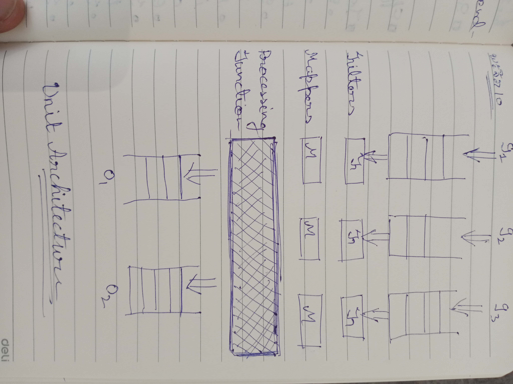
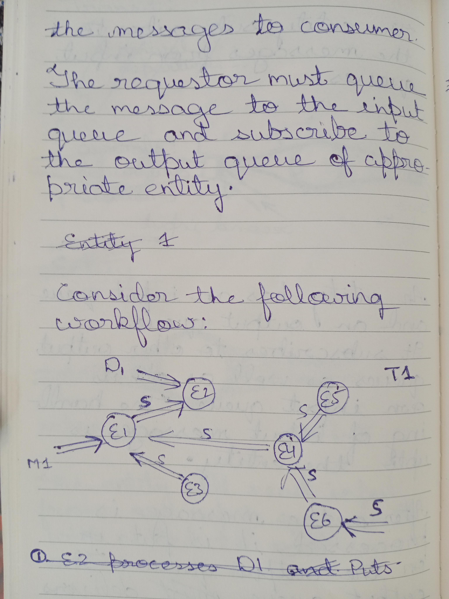
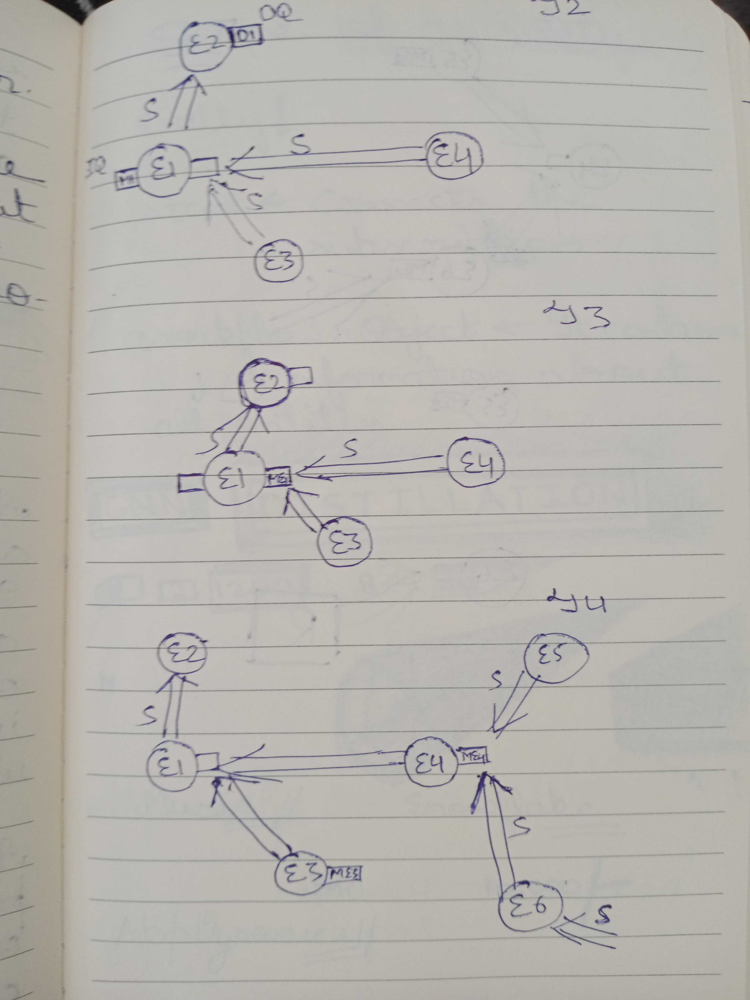
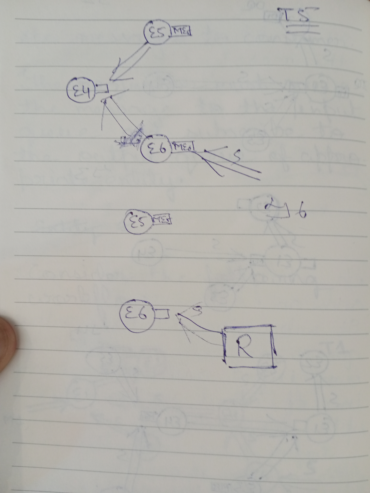

Unit
====
We introduce **Unit**, the primary asynchronous computation entity. A unit is a collection of channels. It applies the fun. It has configurable input or output queues. It is possible to have a queueless unit. A unit applies a function over input data elements. The results are queued to the outputs.



Several units are connected to form a **Network**. The connections are established through *next()* operation. *next()* sends a message to input queues. Typically, a network has a START unit and a FINAL unit. The START unit receives the network inputs. The Final unit emits the network output. Network flow is depicted graphically in:





### Unit Structure
```js
Unit {
  name
  channels = {
    channel1: {provider: {unit: 'name', channel: 'name'}},
    channel2: {}
    channel3: {provider: {unit: unitRef, channel: 'name'}}  
  }

  functions: [
    {
      channels: ['channel1', 'channel2'],
      func: ([c1, c2]) => {
        return {channel3: c1 + c2}
      }
    }
  ]
  
  start()
  next({channel: data})
  stop()
}
```
### Network Structure
```js
Network {
  name
  channels = {
    channel1: {provider: {unit: 'name', channel: 'name'}},
    channel2: {}
    channel3: {provider: {unit: unitRef, channel: 'name'}}  
  }

  functions: [
    {
      channels: ['channel1', 'channel2'],
      func: ([c1, c2]) => {
        return {channel3: c1 + c2}
      }
    }
  ],
  units: {
    unit1: {
      channels: {
        u1channel: {provider: {unit: 'network', channel: 'channel1'}},
        u2channel: {provider: {unit: 'network', channel: 'channel2'}},
      },
      functions: [
        {
          channels: ['u1channel'],
          func: v => {
            return {u2channel: v * 2}
          }
        }
      ]
    }
  }
   
  start()
  next({channel: data})
  stop()
}
```

### Routes
The network and units together is a collection of nodes connected through predefined routes. Functions represent nodes and the channel associations are the predefined routes. A network of cities connected through highways is a close approximation. A trip from one city to another starts with route resolution. Map applications serve exactly that purpose. For our network, we introduce the concept of **routes**. A route is a description of nodes (unit-channel) that a request will follow. A route element has an associated request. A node processes its associated request.

#### Route structure
```js
Route {
  stack
  chain
  
  next()
  append(...elements)
  copy()
  merge(route)
}
```
